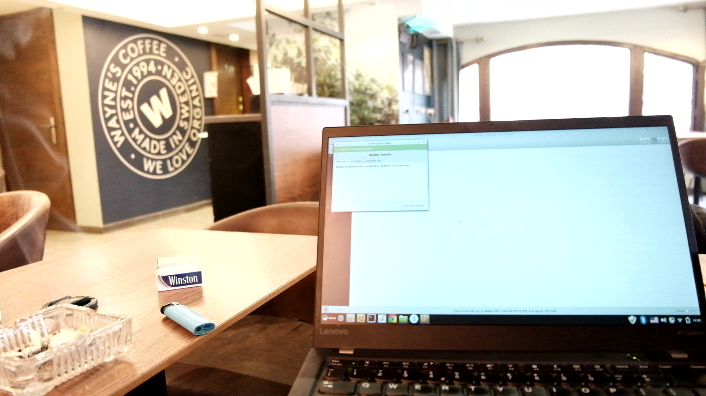
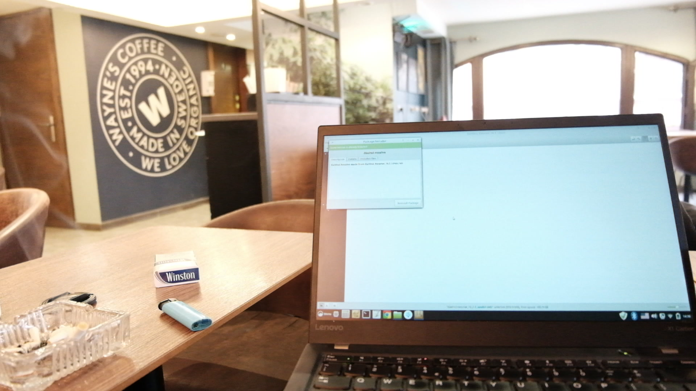

# Fujifilm X-T10 Video Converter

Note: This is a Linux bash script. It probably doesn't work in Windows; however, it should be hard to convert it from Linux to windows if that's so.

This script is based on the following article from Fujirumors.com:

https://www.fujirumors.com/how-to-obtain-better-videos-with-fujifilm-x-cameras/

According to the article, in the "Full Range", the pixel value of each color channel in an 8 bit RGB color space ranges between 0 and 255. However, the "Video Range" only allows the use of values in the range 16 to 235. Therefore, a completely black pixel, which would be a 0 in full range, is a 16 in video range and the same goes for white, which is a 255 in full range and a 235 in video range.

Fujilm cameras record video in full range. However, it seems that the required flag is missing, so a lot of players and editing programs interpret the videos as video range and therefore cut the tonal range.

The article includes the following script that would allow to convert the video from "Video Range" to "Full Range", which leads to the video having a higher dynamic range:

    ffmpeg -i PATH_TO_INPUTFILE -vf scale=in_range=jpeg -vcodec prores -profile:v 1 -acodec copy PATH_TO_OUTPUTFILE.mov

This project uses the script to convert videos in the "from" folder from video range to full range and output the videos to the "to" folder.

To be able to use this script, FFMPEG needs to be installed: www.ffmpeg.org

# How to Use

1) Download and extract the X-T10-Converter.zip file.
2) Put all the videos that need conversion in the "from" folder.
3) Run the script from the command line using ./color-range.sh or by running the script from the GUI.

# Examples
Most noticeable on the cigarettes pack.

Original

Output

